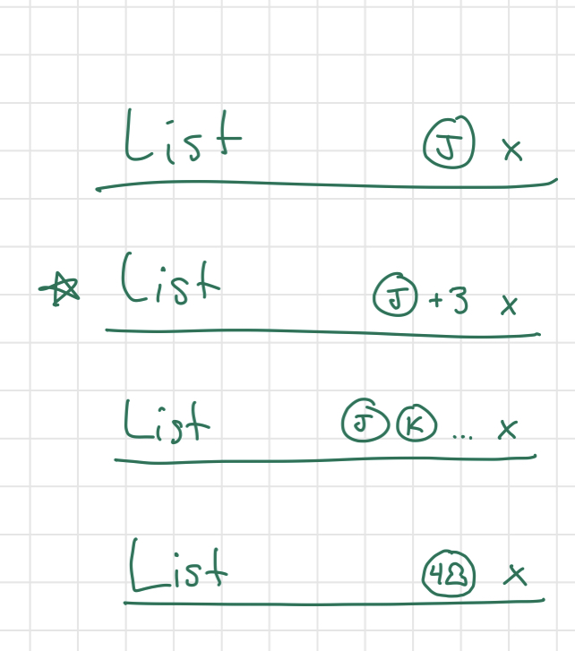

## Design Decisions:

For our final design, we took a lot of inspiration from the Apple Remind app and Desmos. We took ideas from both of
these interfaces and combined them to create our to do list. We got ideas from the Remind app to have the items of our
list have a circle to the left (non-filled in circles for unfinished tasks and filled in circles for finished tasks).
Based on the Remind App, we also decided to put lines under the tasks as a way to separate them without putting boxes
around them. We decided to put the three options to hide, show and delete finished tasks in a three dot dropdown button
at the top. These options are not visible if there are no completed items. We also included our sorting feature here.
There is a button that states what we are currently sorting by, and it has a drop-down to change what the items are
being sorted by (name, time created, and priority). We also have a button that toggles between sort ascending and sort
descending so that users are able to change the order. We decided to have all of these features in a button to make the
list more clean and to reduce the buttons being displayed at a time. Also, when you click the delete option, a pop-up
appears confirming the deletion of all completed items to reduce the possibility of accidentally deleting them.
Additionally, the show and hide options toggle and both options aren't displayed at the same time. We also added a hover
option for these buttons to make them appear clickable. We hoped for a minimalist display with a larger focus on the
actual list rather than the buttons. We put this three dot button at the top next to the title where we think people
will intuitively look for it. When there are no items on the list, we have text that says No items, and we have a plus
sign button to add an item. Then, for future items that need to be added, there is a plus sign button under all current
items to indicate the user to click there when they want a new item. It also changes colors when hovered over to appear
clickable. We hoped for this to be an intuitive and clean way to add new items while keeping the minimalistic look. We
also decided to put a highlight over any item that is currently clicked on and editable. We decided to do this as a way
to indicate to the user that this is the item that is clicked on. Additionally, users can cross off items by pressing on
the circle next to them. What happens next is that the task gets crossed off and changed to a lighter color. We did this
as a way to give the user the satisfaction of crossing off an item and making it less prominent than the unfinished
tasks while not moving or removing it. We also added an "x"
button at the end of every list item in order to delete a single list item. This way, there is an easy way to delete
individual items. This button also changes colors when hovered over to indicate that it is clickable. Next to the "x"
button for each item we have three exclamation marks intended to set the priority. They are all first set to a faded
green and as it is clicked more of the exclamation marks become dark green until it loops back again to all being a
faded green. This is a minimalistic and intuitive way that users can set the priority of each item. The protocol of the
plus, the x and the three dots allows us to keep a simple look while still making the actions discoverable and
intuitive. When to do items are too long and don't fit on the line, the first part appears and there is an ellipse at
the end to indicate that there is more text there. The final feature we added was to make the title of the list
editable. This can fit the users needs more. The default is "To Do List" but this way users can change it to "Grocery
List" or any other title to fit their needs. When adding features for multiple lists, we took inspiration againf from the Remind
App and also from the Notes App. We decided to have a homepage with all the current lists written in a list. From this
home page, a user can click on a list to enter it. Users can also delete lists with the "x" button, similar to before
and they can add lists with a "+" button at the bottom. The design of this homepage has many similar aspects to a To Do List
page to keep uniformity amongst pages in our app.
A link to a Google Drive with a video for how to use this website with keyboard only and
for how to use this website with VoiceOver only can be found here: https://drive.google.com/drive/u/1/folders/1NNGw-m71zcqOuTYeS6niFWOtRSDRXTG9

The lists the user owns and the lists shared with them are separated; the owner and the user's role (either viewer or editor) 
is displayed inside the list itself. Also displayed on the main page is the user's email, and a sign-out button. If the email 
is not verified, the option to verify email is also presented in the upper right-hand corner. This way, all information about 
the user and their login is presented in the same place, out of the way but still easily accessible. For sharing lists, the 
lists that a user owns have a person button next to the delete button. This brings up a pop-up, letting the user know which 
list they're working with, and everyone who has access to it. For each person the user can set them as viewer or editor, and 
also remove them from having the document shared with them entirely. There is also the option to add a new user as either a 
viewer or editor. However, if a viewer has not verified their email they are not able to see the lists that have been shared 
with them. The area for shared lists is still there, with a message that the viewer must verify their email to see them first. 
We chose to keep the title of "Shared Lists" so users can learn about the functionality even if they don't have it at the moment. 
When the user clicks on the verify email button, we also show a popup telling them so. When a user is a viewer on the list, 
we decided it wasn't just enough for their edits to not propagate to the database. Instead, all clicking and typing on the list 
objects is removed. Altogether, the rules for editing and viewing are as follows: if person A shares a list with person B, they 
can add person B as and editor or a viewer. In either case, person B can remove themselves from being able to view the list / 
remove their access to it. Person B can only edits tasks and the title of the list if they are granted edit powers. However, 
person A has complete control over who can view the list, who can edit the list, and can also delete the list which removes it 
for everyone who had access previously. Before accessing any lists, we decided that the user must sign in. Since new users 
must sign up, we split the login page into sign in and sign up, with users also having the option to sign in via google. However, 
this is not the only way to sign in because not everyone has equal access to a google account. As stated previously, if a 
user does not verify their email, they cannot view lists that are shared with them.

#### Images:

Here we can see the first login page.

Here we can see what our homepage looks like when there are no items.

Here is what it looks like when we add a list and when we have a shared list.

Here is the pop up when you delete your own list.

Here is the pop up when you delete a list shared with you

Here is the share settings for your own lists to share them with others.

Here we can see what your own list page looks like when there are no items.

Here is what a shared list looks like once you click into it.

Here we can see what a set item looks like, what a completed item looks like, what an item that is too long to fit on
the line looks like, what set priorities look like for items, and what an item that is currently being edited looks like
with the highlight over it.

Here we can see the options available when the three dots button is clicked.

Here we can see the extension of the sorting menu.

Here we can see how the title looks like when it is being edited

Here we can see the popup asking for confirmation before the user can delete all completed items. Clicking on the
backdrop closes the popup.

## Alternate Designs:

One major design decision is that we were considering putting each todo list item in a box. This is similar to the
Desmos layout. This is what we were considering doing at first because we felt that it was a good way to separate the
items and have a clear divide among them. However, then we realized that if we have a line under each item, this could
also work as a dividing feature. Then, we checked the Remind app and saw that they used lines underneath each item and
this worked well as a way to have the items on a line instead of floating in air but also as a way to divide items. We
ended up liking this more because the divisions were less stark while still being present. Another design decision we
faced is that initially, we wanted to have the background of the list items to alternate colors, for example, item 1
would be green and item 2 would be blue and item 3 would be green again and so on. We originally wanted to do this
because we thought it would help with the readability of the list. However, in the end we decided against this because
we wanted to have the feature that the item currently selected would be highlighted a different color and these two
features wouldn't work well together. We valued more having the selected item highlighted, and so we couldn't have the
alternating colors design. We also realized that the menu button with the
"delete", "show" and "hide" completed item options was only needed when there were completed items. Therefore, it is
hidden otherwise. Additionally, the user doesn't need both show and hide options at the same time so these buttons
toggle in place. We also were planning on having a circle with a black as the last item at all times and have the user
click next to the circle to add a new item. We realized that this may not be intuitive for all users, so we changed the
design to have the plus sign button at the end instead. This allowed us to keep the minimalist design without loosing
discoverability. For the priority feature, we considered different approaches. One idea was to make the items be
different colors based on the priority, but we decided against this because it would clash with our green color scheme.
We also considered an idea of having a right click option on each item. In the end we went with the exclamation idea
because we found it simpler to use and easier to implement.
We were also originally going to have all the sort options shown in the drop-down menu at one time, but we
decided against this because we felt it would be confusing and the user would not be able to clearly tell that the list
was being sorted by. Thus, we ended on the idea of having a drop-down within our drop-down.
When implementing multiple lists, there was a different design that we were first considering. This design was more like
a tab design, like you would find on a browser. For this design, we weren't sure if it was best to include each list title
in the tab and in the list or just in the tab, and we couldnt agree on one decision. We also thought it would be more complicated
to code, without adding significant simplicity to the design. We also were unsure how to maek this design compatible with
different screen sizes in an effective way. Because of these reasons, we decided to go 
with the homepage design. We also considered different ways of displaying our lists in the homepage.
We considered having no separation, separating them with boxes and separating them with lines. 
We landed on separating them with lines to be consistent with our individual list design.
With choosing how to display shared lists vs. the lists a person owns, our first idea was to have every list be shown in the 
same area, with small bubbles or other icons showing whether or not the user is the owner, and who it is shared with. When 
we started sketching this out, the page became cluttered very quickly, so we decided to separate the information. On the main 
list page is whether a list is shared or not (this is designated by an entire section! This also works better for removing certain 
functionality for shared lists). Within each individual list is the user's status and who owns that list. The owner can see 
who has access to the list, and this happens in a popup from the main lists page. All of this works to keep the interface clean 
and still make information accessible to the user.

#### Images:

Here we can see our original design idea of having the list items alternate colors to improve readability. We also show
our final design idea with the highlight for the selected item. The two design ideas did not work well together, so we
had to choose just one. Here we can see why:

Here we can see our different decisions for how to separate the items.

Here we can see our original design of always having the menu button displayed and having a circle under the current
items and having the user click next to the circle to add a new item. The menu item is not needed when there are no
completed items and the circle is not as intuitive for everyone and a plus sign is much more universal.

Here we see our tab design for our multiple lists implementation

Here we see our differing ideas for seperating the list items in our main page

Here are the different sharing options looks we considered.

## User Testing:

During lab 1, We asked one Harvey Mudd student to help us with testing our site. We walked them through the different
scenarios described in the homework. We asked them to practice “Thinking Out Loud” techniques during the usability test.
We basically asked them to talk through all the thoughts they were having while one of us took notes. We prepped them by
saying that the website is not actually functional but that we would show them different pages that would display for
the actions being described. We still asked the user to physically complete the actions even though the website is not
yet functional. For each task, we would start by saying “What would you do if you wanted to…” and then ask them to
explain in words what they would do, practicing the “thinking out loud” skills. Then we would switch the page to the
next page of the flow of the specific task. We did this for all 6 tasks (create an item in an empty list, create an item
in a nonempty list, mask an item as completed, rename an item. Show only uncompleted items, delete all completed items).
After we completed all the tasks, we asked the participant what they liked and didn't like from the website. The student
uses lots of online todo lists. They liked that the interface was clean and minimalistic while still being intuitive.
They would have liked that when an item was marked as completed, that it automatically moved to the bottom of the list,
or to another location and out of the way. The user also mentioned that they would have appreciated a way to delete
single items, which is something that we had not thought of. We could implement this in our next stage by adding an “x”
button to the right of every item. This “x” button could show up only when hovered on an item to keep the clean look.
The user also mentioned that they would have liked a way to title the todo list, create more todo lists and change the
color scheme of the todo list. Based on this, we did incorporate some of these suggestions for our design of Lab 2.

For our second round of user testing, we asked a different Harvey Mudd Student to try out our app. Overall, they found
all actions to be discoverable and usable except the title change. In order to fix this, we could either have a cursor
change on hover or we can add another minimalistic button with a pencil on it next to the tile to indicate that by
clicking on that button, you are able to change the title name. The user also pointed out that our "x" buttons were not
centered in the line. We were able to fix this problem. The user stated that having an "enter" feature would be nice,
meaning that when you are on an input box, and you are down typing, pressing enter would exit out of the input box. The
user found it weird that you were able to cross out empty items or items that had the placeholder text "add an item
here".

For our third round of user testing, we asked a Harvey Mudd Student to try out app. They were able to intuitively
complete all the tasks we asked them to do. One problem is that they would press enter key to exit out of an input box,
and we were not able to implement this feature. Also, the user mentioned how they would have liked the whole item to
show when it was too long (and the To Do List Title too) but this is also a feature we tried to implement but were not
able to.

For our 4th round of user testing, we specifically focused on user testing for 
our new added feature for multiple lists. We asked a student to add a new list,
delete a list and change the title of the list. We also asked the student to 
speak through what they thought as they were completing these tasks. One piece 
of feedback we received is that the student thought that they would be able to change
the name of a list from the homepage but our implementation only allows this action from the 
individual list pages. This is a feature we can look to implement in the future. We were also 
notified of the fact that it is really easy to accidentally delete lists and 
that we might want to include a pop up for the user.

## Challenges you faced:

The main challenge that comes to mind is making decisions as a pair. At times, it was difficult to come to a singular
decision when we both had very different opinions. At times, we would postpone making a decision when this occurred and
worked on other things in the meantime. Then, we would come back to the decision later, when we both had more time to
think about it and state our case more clearly. Most times, we would come up with a third idea that we both liked or one
of us would compromise if it ended up not being as important to us. For example, we got into a pretty long argument
about what font to choose. We wanted to choose a font that is dyslexia friendly but couldn't agree on which one because
if one of us liked a font, the other person hated it. We eventually landed on a font that we both loved and are really
happy with. Working in groups is always hard because everyone has different opinions and even though this was a
challenge, I feel like in the end we made it work, and we learned how to work better with each other. Another challenge
was that at times it was frustrating when we were pair-programming, and we wanted to work on different things. What
would end up happening is that we would work on our separate computers and reconvene in the end to put our work and
ideas together.  
Another general struggle was trying to figure out how to make the html site look like we wanted it to. Some components
of this took a lot of trial and error, such as font size, color, grid column and roseIt was hard at times because we
knew how we wanted it to look, but we didn't know what steps we needed to take to get there. Online documentation was
helpful in these cases but at times they would lead you down a rabbit hole. We also struggled with the grid and the flex
boxes for a while because we couldn't figure out how to get the different items in the specific places that we wanted
them to be. We realized later that we had three separate items in one div, and it wasn't letting us put these items in
different grid coordinates. It took us a while to figure out why this wasn't working. Working with javascript was very
challenging at times. There were times when we needed to make changes in the JavaScript files to add functionality but
then this would affect the look, and we would spend a lot of time in the css file trying to get things to look like we
wanted them to again. For example, there was a time when we needed to add div, but it shifted where the menu item was
placed. Additionally, figuring out where to do certain actions, like delete item, was trial and error because at first
we were very unsure of where this code needed to go. The project at first was very overwhelming due to its size. It was
only after breaking it up into smaller pieces and making actual progress in these smaller parts that we felt it was
manageable but at first it was very overwhelming and getting started was challenging. We had some issues working with
firebase because this is a new interface for us. We had an issue with firebase because the database was not created.
However, the error message was not super helpful, so we struggled for a bit trying to figure out how to fix it. We also
struggled with trying to figure out how to leave an inout box on enter key press and make the input box show the text
wrapped when it is larger than the line. These are features that we spent a while trying to figure out how to do but in
the end we were not able to, and we had to decide to let it go and not have these features in our app. We also 
still hope to add a wrapping feature to our items, which we have not yet been able to 
implement.
The strongest struggle, conceptually, has been understanding how rules work. Not only what role they serve, but also how to 
actually implement them. However, working out the rules in class with a grutor and sitting down completely separate from the 
code to plan out the rules was very helpful.

## Parts you're most proud of:

We are proud that we were able to create a design that is a good blend of intuitive, minimalistic and not overcrowded
while still having all the required features and having these features be discoverable. This allowed us to give the
actual todo list the most emphasis, as this is the main feature of the website. We were able to do this by minimizing
the amount of buttons and creating a clean look. We also like how all the colors fit together. We decided to use
different shades of a similar green, and we think it ended up looking very nice. We are also proud of the font choice,
especially considering how long it took us to get there. We also are proud that we were able to actualize all our final
design plans into html and css code. It is cool that we were able to take our original abstract design ideas into
drawings on paper and finally into the computer. We were able to go through this process from start to finish, and we
are proud of that. We are also proud that we were able to add all the functionality that we needed without needing to
compromise on our design ideas. Overall, we are proud that we were able to make something that we think looks very
pretty and aesthetically pleasing and that we would want to use ourselves. As we got into lab 3, we are really proud
that we were still able to keep the minimalist style even with the addition of new features. This is something we have
valued in our design from the start, so we are happy that we were able to stick with it and still create a functioning
design. We are also proud that we were able to implement many suggestions that we received in the last round of user
testing, like adding a pencil by the To Do List name to make the editable feature more discoverable. 
We are also really proud of how we were able to figure out firestorm to have a main 
collection and a sub-collection and we are proud that for Lab 4, we were able to 
break the tasks down into smaller pieces and make small progress without breaking 
our entire code. For lab5, getting functional rules was absolutely huge for us and we're very excited that we made them work,
especially since we've been experiencing a time crunch and at times considered forgoing the rules entirely. As part of this, 
we took the time to test all the rules we could think of, and have done our best to make the app safe and secure. We're also 
proud of the app in its entirety, as this has been the culmination of a semester of work. We're excited to use our app! And 
pass messages to each other via to do lists, and keep each other accountable.